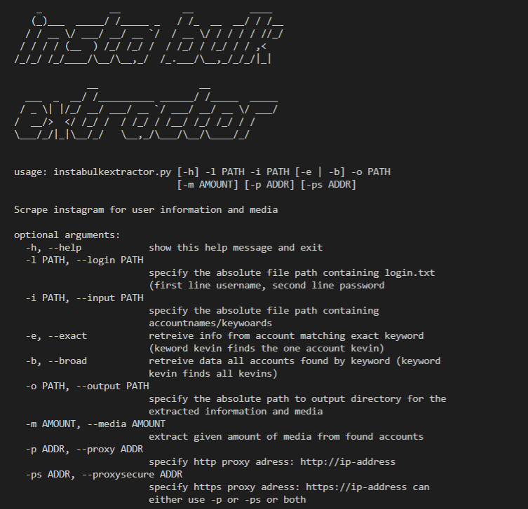
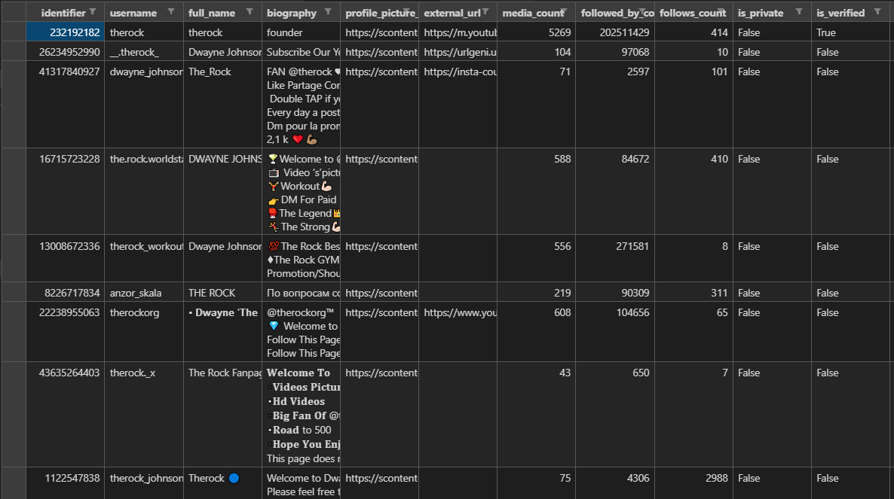
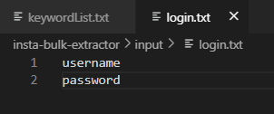
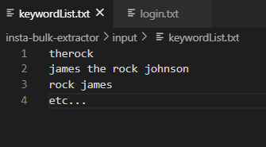

# instabulkextractor
Insta Bulk Extractor will take a list of usernames/keywords. The programm will extract all user information of the users found by instagram with the given keyword/usernames, and export them into a csv file outputted to a specified directory. 

When the -m option is specified it will also exoprt the given amount of latest media to a directory matching the account name within the specified output directory
this media includes both pictures and video's. The programm is only able to extract media from public accounts

Insta bulk extractor will find results identical to the results generated when typing a search term in the instagram app. 
As of yet instabulkextractor does not support fetching a single account. 

The application requires an instagram account to run. the username and password for this account are to be specified in a login.txt file. 

This project runs on the project https://github.com/realsirjoe/instagram-scraper. 
No further coding or configuration is required for the use of instabulkextractor


## Extracted Account Info


## How to install
Simply run:
```
git clone https://github.com/jurjurijur/instabulkextractor.git
cd ~/instabulkextractor
chmod +x instabulkextractor.py
pip install -r requirements.txt
```

## How to run
```
cd ~/instabulkextractor
python3 instabulkextractor.py -l ~/input/login.txt -i ~/input/username.txt -o ~/output/ -m 20 -p http://ip-adress-proxy:portnb
```
## Recommended limits 
Instagram has protection against scraping. 
if you make too many requests too fast you will get a 429 Error or something similar. 

to fight agianst this you can specify a http and/or a https proxy server using tht -p or -ps flag

It is recommended to make a short break between each request of 30s (+- random)
In between all 10 requests a long break (300-600s)
If different proxies and accounts are used for all requests and the circle doesn't repeat too fast these limits don't apply ;)

Feel free to make your own tests and let us know of any limits you experienced

## Login
For the tool to be able to use the instagram account the -l flag needs to lead to a login.txt file.
Its very important that the first line is the username and the second line the password 

Example: 


## Input file 
The input needs to be given using -i file leading to a input.txt file. every keyword/account name needs to be on a seperate line.

:


